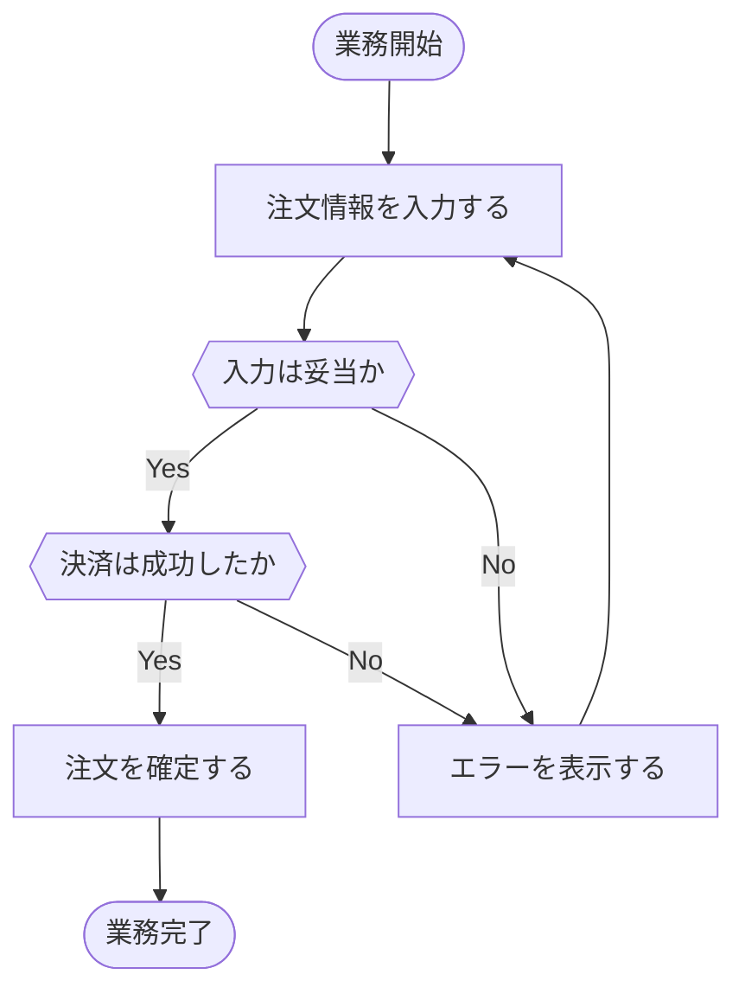
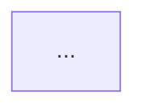

# Acceptance-criteria diagram

Turn the acceptance criteria in the target spec's `docs/specs/<feature>/requirements.md` into a **flow diagram**.

## Purpose

Visualize acceptance criteria as a "business flow" to make gaps and ordering contradictions easy to spot. Draw the flow at the level of a **whole business process, from start to finish** — not per individual action (screen operation).

## Granularity and location

- Granularity: **business unit** (e.g. "order", "signup" — one end-to-end process from start to completion). Do not split by action.
- Location: `docs/specs/_shared/requirements/<business>-diagram.md`
  - `<business>` is a short identifier for the business process (e.g. `order`, `signup`).
- If `<business>-diagram.md` already exists, **merge**: fill gaps from the target spec's acceptance criteria and integrate without contradicting the existing flow. Otherwise create new.

## Drawing rules

Use a Mermaid `flowchart`.

- **Use a hexagon `{{ }}` for decision nodes (do NOT use a diamond `{ }`).**
  - Example: `check{{Did the payment succeed}}`
- Use rounded ends for start/finish (`([Start])` / `([Done])`) and rectangles `[ ]` for steps.
- Put branch labels (Yes / No, etc.) on the edges.
- Annotating nodes/branches with the criterion reference "<requirement>-<item>" (e.g. 要件2-3) helps traceability. In `requirements.md`, acceptance criteria are kept as a numbered list per requirement.

### Example (generated output is Japanese)



## Criteria that read unnaturally in a flow

Do not force every acceptance criterion into the diagram. Criteria that become unnatural or verbose when flow-charted (non-functional requirements, cross-cutting constraints, invariants that always hold, etc.) are written as **prose, not in the diagram**.

Add a「## フロー外の受け入れ条件」section after the diagram and list them as bullets, each with its "<requirement>-<item>" reference.

```markdown
## フロー外の受け入れ条件

- 要件3-2: レスポンスは常に3秒以内に返す（非機能・全ステップ共通）
- 要件4-1: 個人情報は保存時に暗号化する（横断的制約）
```

## File structure (when creating new — content is Japanese)

````markdown
# 受け入れ条件図: <業務名>

<!-- Source specs: docs/specs/<feature>/requirements.md -->
<!-- Created / merged by /kiro-docs -->

## 業務フロー



## フロー外の受け入れ条件

- 要件N-項番: ...

## 参照

- 用語集: [用語集](../glossary.md#glossary-01)
- コンテキスト図: [コンテキスト図](../context-diagram.md#context-01)
````

> Note: the target spec is deleted later in this skill. Keep generated documents self-contained and **do not add live links into the soon-to-be-deleted spec (`docs/specs/<feature>/`)**. Record provenance only via an HTML comment (`Source specs`) as shown above.
