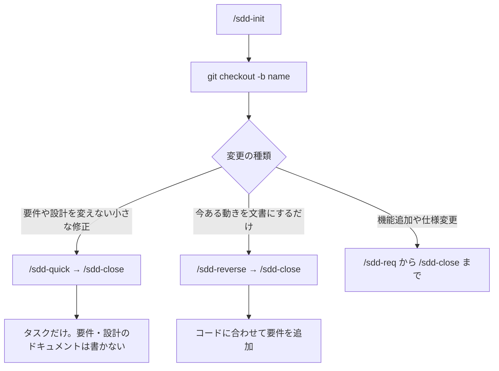
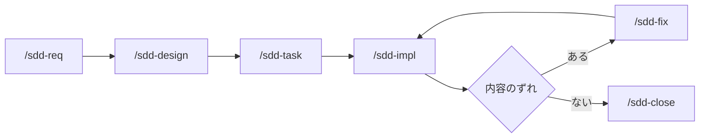
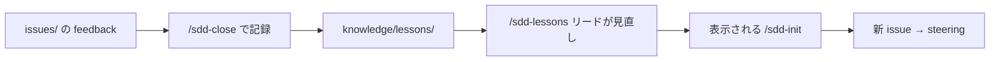

# sdd-orc

[English](README.md)

sdd-orc は Cursor・Codex・Claude Code から [仕様駆動開発（SDD）](https://github.com/paterapatera/sdd-orc) を進めるためのエージェント用スキルと、共通の検査スクリプトをリポジトリに入れるパッケージです。チャットで `/sdd-init` や `/sdd-req` などのスキルを呼び出すと、エージェントが Markdown を書き、検査は各スキルがスクリプト経由で実行します。パッケージ名は `@paterapatera/sdd-orc` 1.2.0 です。Node.js 18 以降が必要です。

issue の登録、プルリクエストの作成、`Closes #1` の記述は別のトラッカー連携スキルの範囲です。このパッケージはトラッカーと通信しません。

## 日常で触るフォルダ

ドキュメントのルートは既定で `docs` です（`npx @paterapatera/sdd-orc init --docs-dir <path>` で変更できます）。

| パス | 意味 |
|---|---|
| `docs/knowledge/` | マージ後も残る仕様・決定記録（ADR）・steering |
| `docs/knowledge/lessons/` | 過去に起きた問題と再発防止の方針（削除せず、状態はここで管理） |
| `docs/issues/<name>/` | ブランチ `<name>` で作業中の変更用ファイル。close 後に削除 |

```text
docs/
  knowledge/          ← 恒久の specs、decision/、steering/、lessons/
  issues/<name>/      ← 変更概要、要件、設計、タスク、feedback（ブランチ上のみ）
```

スキル本文は英語です。Git のブランチ名は issue フォルダ名と同じにしてください（例: ブランチもフォルダも `invoice-fix`、または `PROJ-12-invoice-fix` のようにトラッカーキーを付ける）。

## インストール

```sh
npx @paterapatera/sdd-orc init
```

**インストール後:** まず **エージェントチャット**で `/sdd-steering` を実行します。`docs/knowledge/steering/` の steering ドキュメントを作成します（`init` コマンドでは作りません）。すでにアプリのコードがあるリポジトリでは、コードを読んで steering を合わせます。新規プロジェクトでは初期の steering を作成します。そのあと、変更ごとにベースブランチで `/sdd-init` から始めます。

| オプション | 既定値 |
|---|---|
| `--docs-dir` | `docs` |
| `--lang` | `en` |
| `--base-branch` | `main` |
| `--runtime` | `node` |
| `--skills-dir` | `.agents`（エージェントごとに繰り返す） |

例は次のとおりです。

```sh
npx @paterapatera/sdd-orc init --lang ja --runtime bun --skills-dir .agents --skills-dir .claude
```

`sdd.config.json` を書き、各 `<skills-dir>/skills/` に同じスキルをコピーし、検査スクリプトは最初の skills ディレクトリだけに置きます（例: `.agents/skills/sdd-scripts/sdd.mjs`）。CI でネットワークなしに `check` できるよう、`<skills-dir>` をコミットしてください。

`npx @paterapatera/sdd-orc init` は `docs/knowledge/` の骨組みだけを作ります。`steering/` は作りません（上の **インストール後** を参照）。docs 配下に、このレイアウト外の Markdown があるとコマンドは止まるので、別の `--docs-dir` を指定してください。インストール後に設定を変える場合は `--force` が必要です。

## 更新

```sh
npx @paterapatera/sdd-orc update
npx @paterapatera/sdd-orc migrate
```

`update` はスキルとスクリプトだけを更新し、`knowledge/` は触りません。`migrate` は将来のフォーマット変更用で、現在のフォーマット版 1 では変換はありません。

## スクリプトと status

`check` や `stamp`、`apply`、`renumber`、`index`、`overview` などは、通常の作業では各スキルが自動で実行します。人が手で叩く必要はありません。

各 issue には `overview.html` があります。読みやすさ用の HTML で、`requirements.md` や `design.md` の形は 1.1.0 のままです。`node .agents/skills/sdd-scripts/sdd.mjs overview --issue <name>` で**生成部分**（id 一覧、未回答の質問、設計デルタの steering、requirements+design のハッシュ）を更新します。**エージェント部分**（要約箇条書きと決定表）は `/sdd-req` と `/sdd-design` がマーカーで囲んだ範囲に書きます。`apply` は `overview.html` を読まないので、ファイルの有無で apply 結果は変わりません。

今のフェーズと、次に使うスキルを確認したいときだけ、次を実行します。

```sh
node .agents/skills/sdd-scripts/sdd.mjs status
```

特定の issue や、開いている issue すべてを見る場合は `--issue <name>` や `--all` を付けます。

実装の段階でテストを自動実行したい場合だけ、`sdd.config.json` の任意項目 `testCommand` にコマンドを書きます。

## 同梱スキル

`/sdd-init`、`/sdd-req`、`/sdd-design`、`/sdd-task`、`/sdd-impl`、`/sdd-fix`、`/sdd-close`、`/sdd-lessons`、`/sdd-quick`、`/sdd-reverse`、`/sdd-steering` です。

## どの流れを選ぶか

`/sdd-init` で変更の概要を書くと、内容から流れを決め、次に使うスキル（例: `/sdd-quick` や `/sdd-req`）を案内します。ブランチを切り、そのスキルから進めます。


```mermaid
flowchart TD
  init["/sdd-init"] --> branch["git checkout -b name"]
  branch --> route{変更の種類}
  route -->|要件や設計を変えない小さな修正| quickPath["/sdd-quick → /sdd-close"]
  route -->|今ある動きを文書にするだけ| revPath["/sdd-reverse → /sdd-close"]
  route -->|機能追加や仕様変更| fullPath["/sdd-req から /sdd-close まで"]
  quickPath --> noteQuick["タスクだけ。要件・設計のドキュメントは書かない"]
  revPath --> noteRev["コードに合わせて要件を追加"]
```

### 通常の機能追加

新しい振る舞いや仕様の変更です。init が `/sdd-req` を案内したあとの流れは次のとおりです。


```mermaid
flowchart LR
  R["/sdd-req"] --> D["/sdd-design"]
  D --> T["/sdd-task"]
  T --> I["/sdd-impl"]
  I --> F{内容のずれ}
  F -->|ある| X["/sdd-fix"]
  X --> I
  F -->|ない| C["/sdd-close"]
```

手順。**エージェントチャット**と書いてある操作はチャット、それ以外はターミナルです。

1. **エージェントチャット:** ベースブランチで `/sdd-init`（変更の概要を作成。ブランチはまだ作らない）。
2. **ターミナル:** `git checkout -b <name>`（init が決めた issue フォルダ名と同じ）。
3. **エージェントチャット:** `/sdd-req` → `/sdd-design` → `/sdd-task` → `/sdd-impl`。各スキルの指示どおりコミットする。ずれたら `/sdd-fix` してから続ける。
4. **エージェントチャット:** `/sdd-close` でベースを取り込み、恒久ドキュメントを更新し、issue フォルダを削除し、PR 用のタイトルと本文を表示する（PR は開かない）。

### 小さな変更（quick）

仕様・steering・決定記録を変えずに済む小さな修正です。上と同じ 1・2 のあと、**エージェントチャット**で `/sdd-quick`（タスクだけ）→ `/sdd-close`。仕様や steering の更新が必要ならそこで止まります。

### 既存の振る舞いの記録（reverse）

**コードにはすでに動きがあるのに、仕様に書かれていない**ときに使います。典型例は既存アプリに SDD を入れた直後（コードから仕様を埋める）、または残したい動きが文書化されていないと気づいたときです。一度に全部を書く必要はありません。重要な機能や、これから手を入れる機能から始めてください。

**`/sdd-steering` との違い:** steering は**プロジェクト全体**の前提（目的、技術、構成など）をまとめます。インストール後に一度行う。reverse は**一つの機能**について、すでにあるコードの動きを `specs/` の要件として残す。機能ごとに `/sdd-init` から繰り返す。

最初から `/sdd-reverse` だけを呼ばないでください。**ベースブランチ**で **エージェントチャット**に、次のような文をそのまま送れます。

```text
/sdd-init 請求書の締め処理の今の動きを仕様に記録したい。コードは変えない。
```

要点は **すでにある動きを文書に残す**ことで、新機能の追加やバグ修正ではないと伝えることです。init が最大 3 問聞く場合も、同じ目的で答えてください。

init が終わると変更の概要を書き、**コードを変えない文書化**として分類し、次のスキルは **`/sdd-reverse`** と案内します。そのあと **ターミナル** `git checkout -b <name>`、**エージェントチャット** `/sdd-reverse` → `/sdd-close`。設計やタスクのドキュメントは省略されることが多く、close でも検査は走ります。

## GitHub の issue と連携して使う場合

GitHub Issues で進捗を管理するときの例です（issue や PR の作成はこのパッケージの範囲外。別のトラッカー連携スキルか手作業）。

1. **エージェントチャット:** ベースブランチで、予定している変更の数だけ `/sdd-init` を実行する。
2. 各変更を GitHub issue として登録する（トラッカースキルまたは手動）。
3. フォルダ名・ブランチ名の先頭に issue 番号やキーを付ける（例: `42-invoice-fix`）。
4. **ターミナル:** ベースブランチへ変更概要をコミットする。
5. **ターミナル:** issue ごとに `git checkout -b <name>`。**エージェントチャット:** スキルを `/sdd-close` まで実行する。PR を開くときは `Closes #42` などで issue と結び付ける（手動またはトラッカースキル）。

## 教訓（lessons）・close・見直し

作業中、スキルがブランチ上の `docs/issues/<name>/feedback.md` に短いメモを追記することがあります（日常の仕様作業で人が編集するものではありません）。追記したらブランチにコミットしておき、close の前にメモが消えないようにします。**`/sdd-close`** では、エージェントがそのメモを読み、`docs/knowledge/lessons/` に**記録**します。新規は状態 **`candidate`**。再発は **Occurrence log** に日付付きの行を足します（issue 名は書きません）。再発がなく見直した close には **Review closes** の日付を足します。issue フォルダを消す前に、「この教訓を記録してよいか」といった**短い確認**だけをします。`- Lessons:` 行は検査用に残します。close では steering を直さず、教訓の状態も採用判断もしません。**`/sdd-init` の文も出しません**。

**リード**が定期的に **`/sdd-lessons`** を実行して、採用（試行 `trial`）、却下、保留、昇格（`effective` / `ineffective`）を決めます。例: **`/sdd-lessons 今月の教訓を見直したい`**。一覧は **A〜D** のいずれか**一つ**にだけ載せます（未判断の候補、保留・却下後の再発、有効に上げられる trial ※ログより**後の日付**の **Review closes** が条件を満たし、かつ **Last reviewed** より**後の日付**の close が少なくとも 1 件（同日は数えない）、再発した trial/effective ※**C** と **D** が両方当てはまるときは **D** のみ — 詳細はスキル本文）。steering 変更は **`/sdd-init ...`** の案のみ（close ではありません）。教訓は削除しません。要件や実装のスキルが読むのは **steering だけ**で、教訓ページは読みません。通常の `check` で教訓ページが変わったとき、索引だけ自動で直ることがあり、そのとき短いメモが出ます。

ベースを取り込んで **re-close** するとき、同じ教訓ページが競合したら、状態は rejected → ineffective → effective → trial → candidate の順で厳しい方を残し、rejected または ineffective が勝った場合はその Reason を残します。


```mermaid
flowchart LR
  issue["issues/ の feedback"] --> close["/sdd-close で記録"]
  close --> lessons["knowledge/lessons/"]
  lessons --> review["/sdd-lessons リードが見直し"]
  review --> steerMsg["表示される /sdd-init"]
  steerMsg --> newIssue["新 issue → steering"]
```

## 人が決めるところ

| スキル | 作業内容 |
|---|---|
| `/sdd-init` | 目的・変更内容・対象外について最大 3 問 |
| `/sdd-req`、`/sdd-design`、`/sdd-reverse`、`/sdd-fix` | 1 ラウンド最大 5 問（スコア付き選択肢） |
| `/sdd-steering` の Resync | 差分を 1 件ずつ承認・却下・保留 |
| `/sdd-impl` | タスク一覧の手動確認項目を実施（自動ではチェックしない） |
| `/sdd-close` | マージ競合の解消、仕様コードの変更確認（求められた場合）、**教訓の記録の確認**、PR 文面のコピー |
| `/sdd-lessons` | **リード:** 教訓の採用・却下・保留・昇格、`/sdd-init` 案の表示（steering は直接編集しない） |

Quick は質問しません。`/sdd-task` も質問しません。

## issue 概要（`overview.html`）

置き場所: `docs/issues/<name>/overview.html`（ブランチ名と同じ `<name>`）。

**マーカー（名前を変えない）**

| マーカー | 役割 |
|---|---|
| `<!-- sdd-orc:overview:generated:begin -->` … `<!-- sdd-orc:overview:generated:end -->` | `sdd overview <issue>` が書く。手で直さない |
| `<!-- sdd-orc:overview:agent:begin -->` … `<!-- sdd-orc:overview:agent:end -->` | `/sdd-req` と `/sdd-design` が書く。`overview` を再実行しても残る |

生成側 `<section data-sdd-part="generated">` には `data-sdd-content-hash`、`data-sdd-list="added|modified|removed"`、未回答・回答済みの質問、設計デルタの steering 変更、`id="sdd-id-<ID>"` のアンカーがあります。エージェント側 `<section data-sdd-part="agent">` の `data-sdd-undecided-count` は、`data-sdd-cell="undecided"` のセル数と一致させます。要約は `<li data-sdd-ids="REQ-…,IF-…">`（カンマ区切り。`11〜13` や `14・15` のような範囲表記は不可）。表は `<div data-sdd-table="1" data-sdd-table-kind="…">` で**最大 2 つ**。セル種別: `decided`（短い説明 + id）、`undecided`、`impossible`（`data-sdd-reason` 必須）、`none`（`data-sdd-reason` 必須）。表の型は `/sdd-req` スキル（画面、権限、API、バッチ、状態遷移、移行、外部連携、同時実行など）から選び、空値・長さ・ケースなどの細かい値は従来のレビューチェックリストに残します。

**1.2.0 からの移行:** 1.1.0 で始めた issue も、`check` を通すには有効な `overview.html` が必要です。`sdd overview <issue>` のあと、同梱の `example-overview.html` を形の参考にエージェント部分を書いてください。

### overview 検査コード

| コード | 直し方（1 行） |
|---|---|
| `OVERVIEW_MISSING` | `sdd overview <issue>` を実行し、エージェント部分をマーカー内に書く |
| `OVERVIEW_GENERATED_MISMATCH` | `sdd overview <issue>` で生成部分を更新する |
| `OVERVIEW_STALE_HASH` | requirements または design を変えた → `sdd overview <issue>` |
| `OVERVIEW_AGENT_MISSING` | `<!-- sdd-orc:overview:agent:begin/end -->` の間にエージェント部分を置く |
| `OVERVIEW_SUMMARY_BULLETS` | `ul[data-sdd-bullets]` の `<li>` を 3〜5 個にする |
| `OVERVIEW_TABLE_COUNT` | `div[data-sdd-table]` は 2 つまで |
| `OVERVIEW_UNKNOWN_ID` | 仕様ツリーかこの issue の requirements デルタにある id だけ使う |
| `OVERVIEW_SUMMARY_NO_ID` | デルタに要件 id があるとき、要約に id を 1 つ以上入れる |
| `OVERVIEW_TABLE_NO_ID` | デルタに要件 id があるとき、表の decided セルに id を 1 つ以上入れる |
| `OVERVIEW_UNDECIDED_COUNT` | `data-sdd-undecided-count` を undecided セル数と揃える |
| `OVERVIEW_ID_RANGE` | id を 1 つずつ列挙する（`〜` `・` `/` でまとめない） |
| `OVERVIEW_CELL_REASON` | `impossible` と `none` に `data-sdd-reason` を付ける |
| `OVERVIEW_BARE_ID_CELL` | decided セルは id だけにしない（説明を添える） |
| `OVERVIEW_CELL_NO_ID` | decided セルに id が無い → テキストか `data-sdd-ids` で id を付ける |
| `OVERVIEW_CELL_MIXED` | 決まった内容と未決定を別セルに分ける |

## プルリクエスト CI（推奨）

```yaml
name: sdd
on:
  pull_request:
jobs:
  check:
    runs-on: ubuntu-latest
    steps:
      - uses: actions/checkout@v4
      - uses: actions/setup-node@v4
        with:
          node-version: 24
      - run: node .agents/skills/sdd-scripts/sdd.mjs check
```

このチェックを必須にすることや、マージ前にベースへ追従させることはリポジトリ設定の推奨であり、このパッケージが強制するものではありません。
