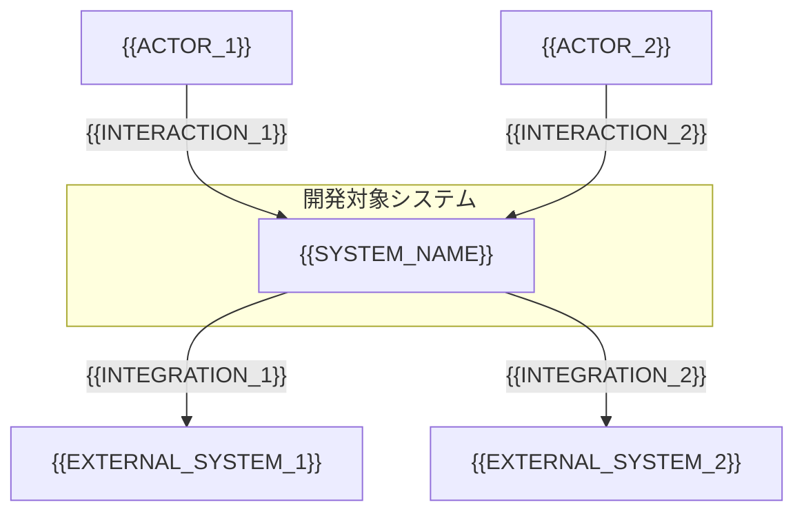

# コンテキスト図

<!-- Material ID: Context-01 -->
<!-- Output: docs/specs/_shared/context-diagram.md (project-wide; one diagram for multi-domain boundary) -->
<!-- Created by /kiro-docs from docs/settings/templates/specs/supplements/context-diagram.md -->

## Context-01

開発対象システムの境界と、外部アクター・外部システムとの関係を 1 枚で示す。スコープの認識ズレを防ぐ。

## スコープ

- **システム名**: {{SYSTEM_NAME}}
- **最終更新**: {{TIMESTAMP}}

## 図

## 境界の補足

| 要素 | 対象範囲 | 対象外 | 備考 |
| :--- | :------- | :----- | :--- |
| {{SYSTEM_OR_MODULE}} | {{IN_SCOPE}} | {{OUT_OF_SCOPE}} | {{NOTES}} |

## データフロー（任意）

| 送信元 | 送信先 | データ / イベント | 信頼境界 |
| :----- | :----- | :---------------- | :------- |
| {{SOURCE}} | {{TARGET}} | {{DATA_OR_EVENT}} | {{TRUST_NOTE}} |

## 参照

- 用語集: [用語集](glossary.md#glossary-01)
