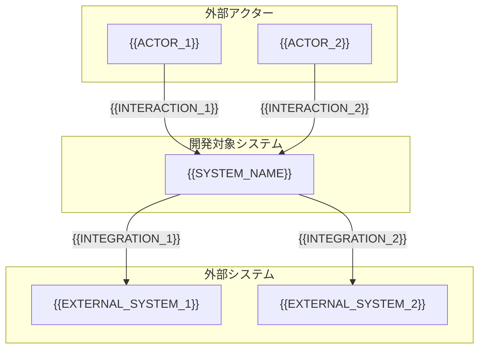

# コンテキスト図

<!-- Material ID: Context-01 -->
<!-- Output: docs/specs/_shared/context-diagram.md (project-wide; one diagram for multi-domain boundary) -->
<!-- Created by /kiro-validate-requirements-doc from docs/settings/templates/specs/supplements/context-diagram.md -->

## Purpose

開発対象システムの境界と、外部アクター・外部システムとの関係を 1 枚で示す。スコープの認識ズレを防ぐ。

## Scope

- **システム名**: {{SYSTEM_NAME}}
- **最終更新**: {{TIMESTAMP}}

## Diagram

## Boundary notes

| 要素 | In scope | Out of scope | 備考 |
| :--- | :------- | :----------- | :--- |
| {{SYSTEM_OR_MODULE}} | {{IN_SCOPE}} | {{OUT_OF_SCOPE}} | {{NOTES}} |

## Data flows (optional)

| From | To | データ / イベント | 信頼境界 |
| :--- | :- | :---------------- | :------- |
| {{SOURCE}} | {{TARGET}} | {{DATA_OR_EVENT}} | {{TRUST_NOTE}} |

## References

- Glossary: `Glossary-01` → `docs/specs/_shared/glossary.md`
- Requirements: `docs/specs/{{FEATURE}}/requirements.md`
