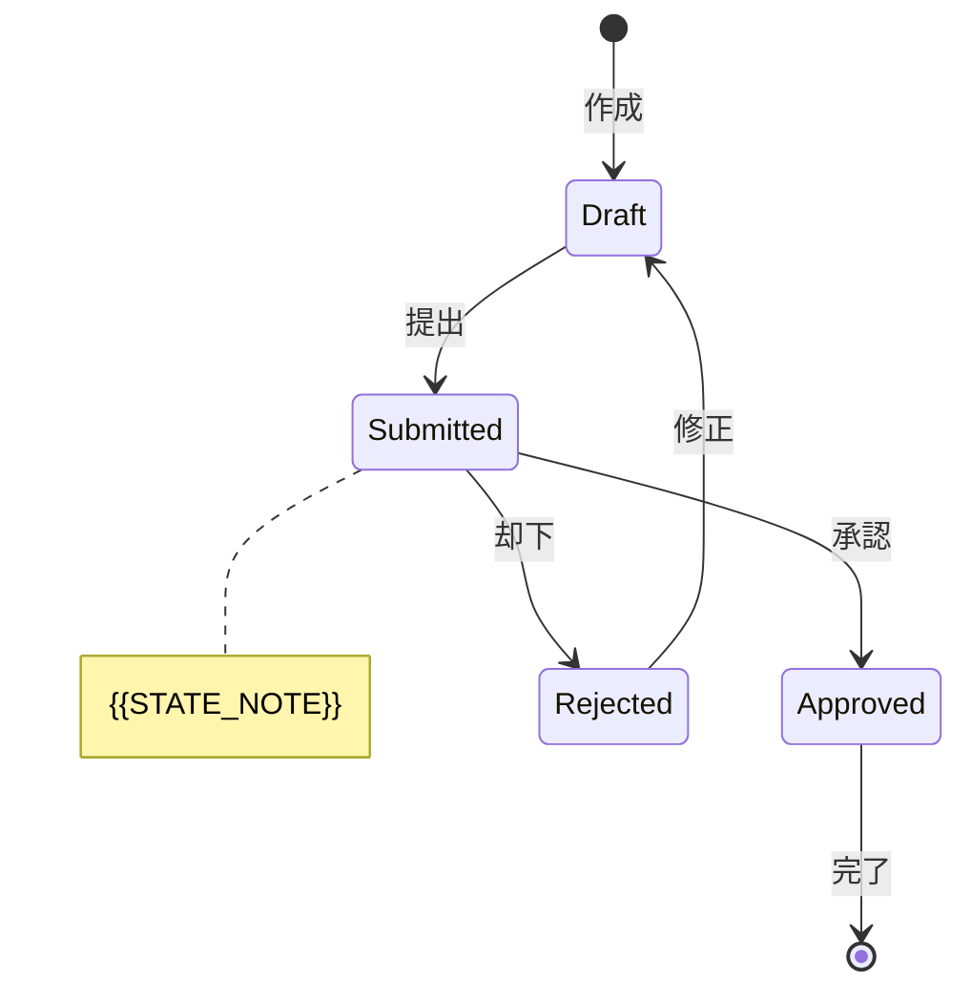

# 状態遷移図

<!-- Material ID: State-{{DOMAIN}}-01 (example: State-Order-01) -->
<!-- Output: docs/specs/{{FEATURE}}/supplements/state-transition.md -->
<!-- Template source: docs/settings/templates/specs/supplements/state-transition.md -->
<!-- Created by /kiro-validate-requirements-doc when status flows are complex -->

## Purpose

エンティティやプロセスの状態と遷移を可視化し、`While <特定の状態>` 定義時の遷移漏れ・矛盾を防ぐ。State-driven の EARS AC を支える。

## Scope

- **対象エンティティ / プロセス**: {{ENTITY_OR_PROCESS_NAME}}
- **Material ID**: State-{{DOMAIN}}-01
- **最終更新**: {{TIMESTAMP}}

## Diagram

<!-- 上記はプレースホルダー。実際の状態名・遷移に置き換える -->

## Transition table

| Transition ID | From | To | トリガー (When) | 前提 (While) | ガード条件 | 関連 AC |
| :------------ | :--- | :- | :-------------- | :----------- | :--------- | :------ |
| ST-001 | {{FROM_STATE}} | {{TO_STATE}} | {{TRIGGER}} | {{PRECONDITION}} | {{GUARD}} | {{AC_REF}} |
| ST-002 | {{FROM_STATE}} | {{TO_STATE}} | {{TRIGGER}} | {{PRECONDITION}} | {{GUARD}} | {{AC_REF}} |

## Invalid transitions (optional)

<!-- 許可されない遷移を明示すると Unwanted Behavior AC のたたき台になる -->

| From | To | 理由 | システム応答 |
| :--- | :- | :--- | :----------- |
| {{FROM_STATE}} | {{TO_STATE}} | {{REASON}} | {{SYSTEM_RESPONSE}} |

## State definitions

| 状態 | 定義 | 終端状態 | 備考 |
| :--- | :--- | :------- | :--- |
| {{STATE}} | {{DEFINITION}} | はい / いいえ | {{NOTES}} |

## References

- Glossary: `Glossary-01` → `docs/specs/_shared/glossary.md`
- Requirements: `docs/specs/{{FEATURE}}/requirements.md`
