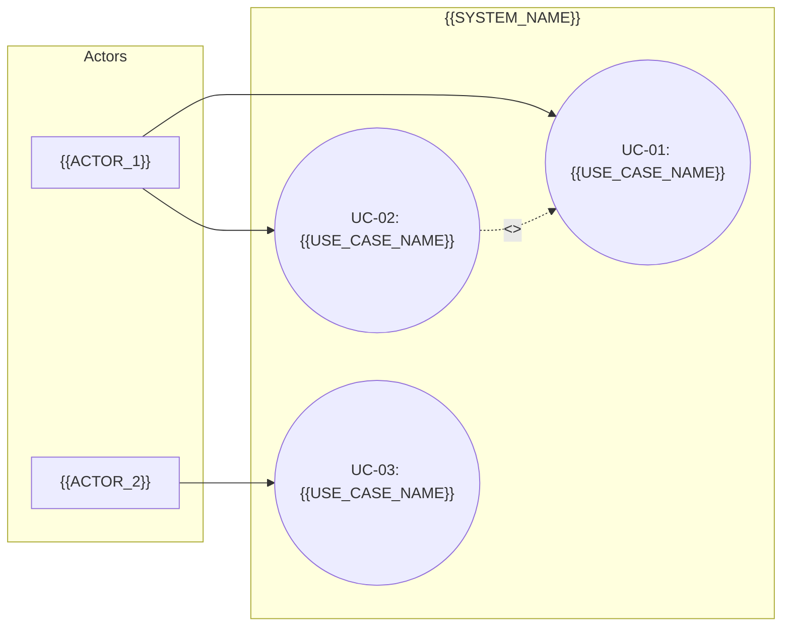

# ユースケース図

<!-- Material ID: UC-{{DOMAIN}}-01 (example: UC-Order-01) -->
<!-- Output: docs/specs/{{FEATURE}}/supplements/use-case-diagram.md (one per domain/feature) -->
<!-- Template source: docs/settings/templates/specs/supplements/use-case-diagram.md -->
<!-- Created by /kiro-validate-requirements-doc -->

## UC-{{DOMAIN}}-01

ドメイン（業務領域）単位でユースケースを整理し、EARS 要求への書き起こしを支援する。

## Scope

- **ドメイン / Feature**: {{DOMAIN_OR_FEATURE_NAME}}
- **Material ID**: UC-{{DOMAIN}}-01
- **最終更新**: {{TIMESTAMP}}

## Diagram

## Use case list

| UC ID | ユースケース名 | 主アクター | 概要 | 関連 Requirement / AC |
| :---- | :------------- | :--------- | :--- | :-------------------- |
| UC-01 | {{USE_CASE_NAME}} | {{ACTOR}} | {{SUMMARY}} | {{REQ_OR_AC_REF}} |
| UC-02 | {{USE_CASE_NAME}} | {{ACTOR}} | {{SUMMARY}} | {{REQ_OR_AC_REF}} |

## Preconditions & triggers (optional)

<!-- Event-driven / State-driven AC への橋渡し -->

| UC ID | トリガー (When) | 前提状態 (While) | 備考 |
| :---- | :-------------- | :--------------- | :--- |
| UC-01 | {{TRIGGER}} | {{PRECONDITION}} | {{NOTES}} |

## References

- Glossary: [用語集](../../_shared/glossary.md#glossary-01)
- Context diagram: [コンテキスト図](../../_shared/context-diagram.md#context-01)
- Requirements: [要件定義](../requirements.md)
